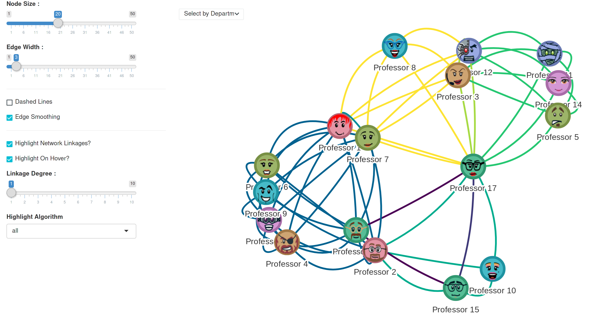

This app provides an interactive interface for Neural Network Analysis (NNA) using the `visNetwork` package, allowing [D3](https://d3js.org) interaction with data, nodes and edges.

## Background

The visualization of complex networks can reveal unexpected insights into relationships between people and groups in a variety of social, business and academic settings. For instance, if a university was looking to improve collaboration between departments, they might produce a tag list associated with each faculty member and (as an example) data science techniques in use across the school. The resulting dataframe might look something like this: 

| Name  | Department | Tags |
| ------------- | ------------- | ------------- |
| Professor 1 | Anthropology | GIS, Survey |
| Professor 2 | Anthropology | GIS, Machine Learning  |
| Professor 3 | Art | Qualitative, Survey |
| Professor 4 | Art | GIS |
| Professor 5 | English | Qualitative |
| Professor 6 | English | GIS |
| Professor 7 | English | Survey, GIS |
| Professor 8 | History | Survey |
| Professor 9 | History | GIS |
| Professor 10 | History | Machine Learning |
| Professor 11 | Philosophy | Qualitative |
| Professor 12 | Philosophy | Survey, Qualitative |
| Professor 13 | Spanish | GIS |
| Professor 14 | Spanish | Qualitative |
| Professor 15 | Geosciences | Machine Learning, Compositional |
| Professor 16 | Geosciences | GIS, Compositional |
| Professor 17 | Geosciences | Compositional, Survey, Machine Learning, Qualitative |

This app provides a graphical means of exploring the dataframe and the relationships between individuals and departments, highlighting the strength of existing connections and potentially revealing areas for future development.

## Use

The sidebar of this app allows users to adjust:

* node and edge parameters 
* alter the linkage sensitivity and highlight algorithm
* filter the visualization based on departments

The output can be zoomed, nodes can be dragged to reorient the plot, and hovering enables tooltip pop-ups to describe the shared technologies between faculty members.
